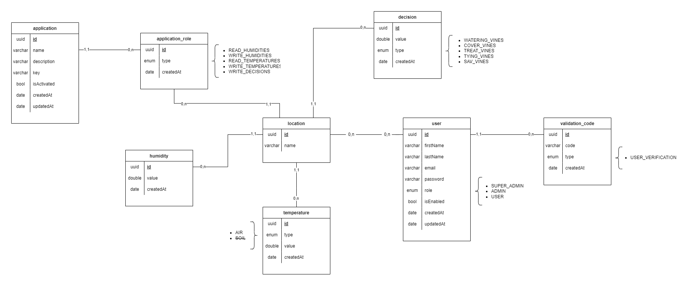

# Documentation : more information

## Database schema

  PostgreSQL database schema

 

## Applications

Applications are the different external applications that can call the API.
In order for an application to call the API, it must be manually added to the database.

> **Note**: When creating an application, fill in a secure key that will be used for authentication.

> **Note**: Don't forget to add roles in the `application_role` table for each application to access the different routes.

 

## Fixtures

Fixtures are data that will be used for testing and preproduction.
For convenience, fixtures are generated via the test scripts.

### Operation of temperature/humidity fixtures

To generate the temperature and humidity data, an algorithm has been designed.
It is based on the following principles:

- The min and max of the temperature is generated randomly between two values.
  (If there is already a value filled in the previous day, the min will be equal to it).

- The highest temperature peak of the day is chosen randomly between an interval of 2 different hours.
  It can last between 1h and 2h.

- To have a temperature curve, we define random points between midnight and the peak time and vice versa.
  Each of these peaks will increase the temperature by 0.5°.
  After the peak time, the point will be reduced by 0.5° until the next day.

 
- The temperature data is added to the database for every minute.

- To generate the humidity, we multiply the temperature by 2

 

#### Graphic example with peak points

Temperature graph with peak points for one day

 

#### Final graphic example

Graph of temperature and humidity for one day

